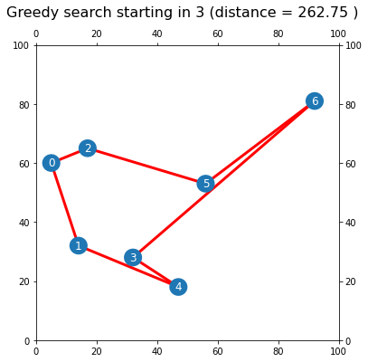

# Traveling Salesman Problem Solver
### Author: [Your Name]

This repository contains an implementation of search algorithms to solve the <strong>Traveling Salesman Problem (TSP)</strong>. The project visualizes the shortest path for a traveling salesman using various search strategies and highlights their performance on small graphs.

---

## Table of Contents
1. [Overview](#overview)
2. [Installation](#installation)
3. [Features](#features)
4. [Usage](#usage)
5. [Methodology](#methodology)
6. [Results](#results)
7. [Future Work](#future-work)
8. [Contributing](#contributing)
9. [License](#license)

---

## Overview

<p align="justify">
The Traveling Salesman Problem (TSP) is a classic optimization problem where a salesman must visit a set of cities, each exactly once, and return to the starting city, minimizing the total travel distance. This project implements and compares search algorithms such as <strong>Greedy Search</strong>, <strong>Brute Force</strong>, and others to solve the TSP. It also visualizes the routes and distances for better understanding.
</p>

---

## Installation

To set up and run this project, follow these steps:

1. Clone the repository:
   ```bash
   git clone https://github.com/your-repo/tsp-solver.git
   cd tsp-solver
   ```
2. Create a virtual environment:
   ```bash
   python -m venv env
   source env/bin/activate  # On Windows: env\Scripts\activate
   ```
3. Launch the Jupyter Notebook:
   ```bash
   jupyter notebook
   ```

## Features

### Algorithm Implementations
- <strong>Greedy Search</strong>:
  - Selects the nearest unvisited city at each step.
  - Fast but may not guarantee the optimal solution.
- <strong>Brute Force</strong>:
  - Explores all possible routes to find the exact optimal solution.
  - Computationally expensive but guarantees the best result.

### Visualization
- Dynamic plotting of the paths and nodes for the TSP.
- Displays the total distance for the selected route.

### Performance Comparison
- Compare execution time and accuracy for different algorithms.

---

## Usage

### Data Input
- Define cities as coordinates in the form of a graph.

### Run Algorithms
- Use `search_algorithms_Travelling_salesman.ipynb` to:
  - Execute Greedy Search and Brute Force methods.
  - Visualize the paths generated by each algorithm.

### Visualization
- View graphs of routes taken by each algorithm, with distances annotated:
  - Example visualization:  
    

---

## Methodology

### Steps

#### Graph Creation
- Define cities as nodes and distances as edges.

#### Search Algorithms
- Implement Greedy Search and Brute Force for pathfinding.

#### Visualization
- Plot the path and highlight the total distance.

---

## Results

### Greedy Search
- Produces a fast solution but does not always find the optimal path.
- Example visualization:  
  

### Brute Force
- Finds the optimal path but is computationally expensive for larger graphs.

---

## Future Work

### Algorithm Improvements
- Add more advanced algorithms like Genetic Algorithms, Simulated Annealing, or Ant Colony Optimization.

### Scalability
- Optimize the system for larger datasets with hundreds of nodes.

### Dynamic Features
- Allow real-time user input for city coordinates and distances.

---

## Contributing

Contributions are welcome! Feel free to fork the repository, make improvements, and submit a pull request. If you encounter any issues, open a GitHub issue for discussion.

---

## License

This project is licensed under the MIT License. See the [LICENSE](./LICENSE) file for more details.
